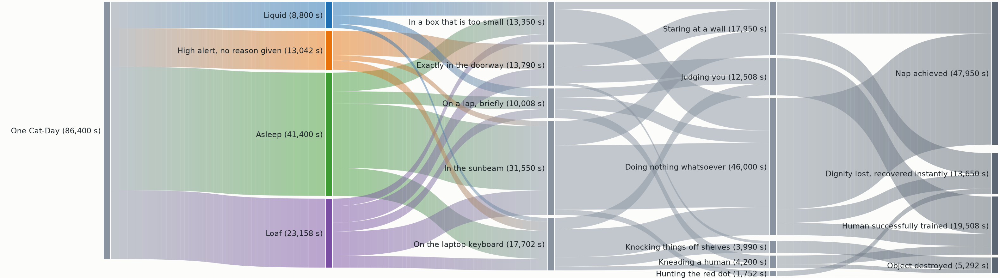
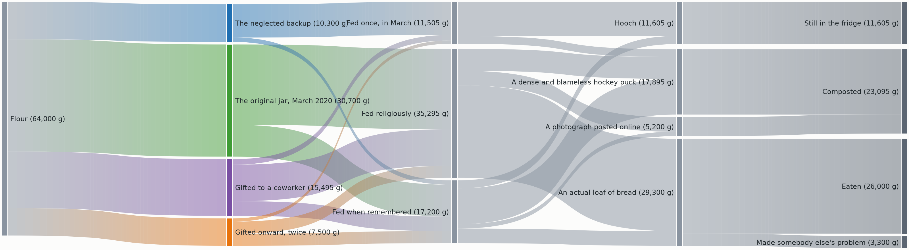
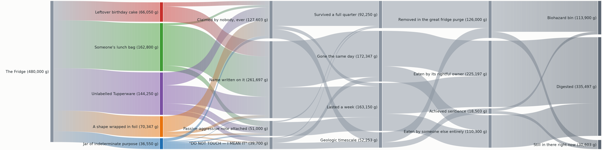
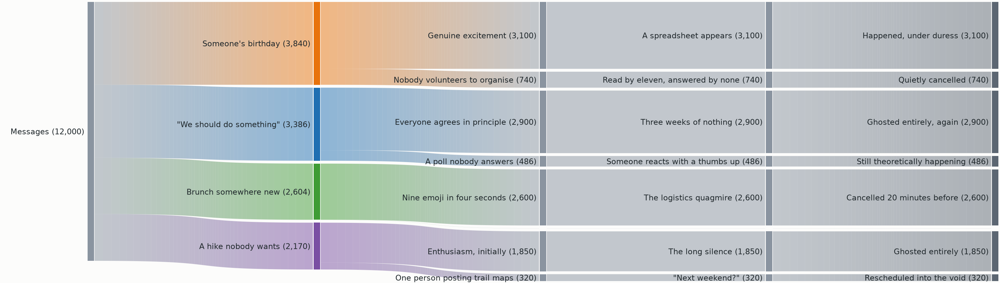
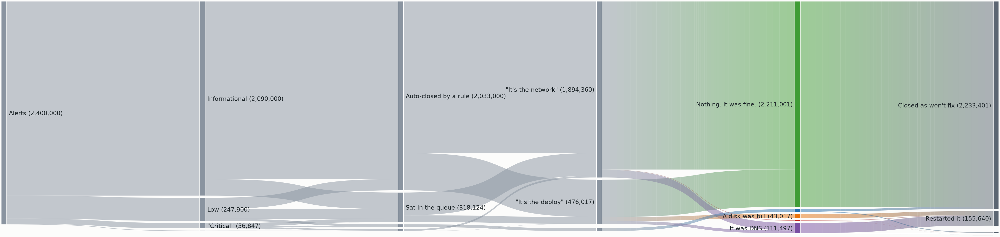

# sankey_mpl

Sankey diagrams for matplotlib, as clean vector output.



```python
from sankey_mpl import render_sankey, save

nodes = {
    "visits": {"label": "Visits (12,400)", "color": "#9AA5B1"},
    "signup": {"label": "Signed up (3,100)", "color": "#4C78A8"},
    "bounced": {"label": "Bounced (9,300)", "color": "#E45756"},
    "paid": {"label": "Subscribed (820)", "color": "#54A24B"},
    "lapsed": {"label": "Lapsed (2,280)", "color": "#F58518"},
}
links = [
    {"from": "visits", "to": "signup", "flow": 3100},
    {"from": "visits", "to": "bounced", "flow": 9300},
    {"from": "signup", "to": "paid", "flow": 820},
    {"from": "signup", "to": "lapsed", "flow": 2280},
]

result = render_sankey(nodes, links, {"label_gutter_px": 120})
save(result, "funnel.svg")
```

## Why this one

- **Genuinely vector.** No rasterised artists anywhere, so SVG and PDF stay
  scalable and the text stays selectable. Most matplotlib sankey code fakes its
  gradients with an image, which silently embeds a bitmap per ribbon.
- **Reproducible.** The same input produces byte-identical output, so a generated
  document's content hash is stable and golden-file tests are possible.
- **Exact pixel geometry.** One data unit is one point is one pixel, so the
  diagram lands at the size you asked for and `fontsize=12` means 12 pixels.
- **Everything is a config key.** Node width, gap, curve shape, gradient
  resolution, label placement, export settings. No subclassing to tune a number.
- **It refuses bad input.** Cycles, backward links, disconnected graphs and nodes
  too short for their own links raise instead of rendering something misleading.

Not a general graph-drawing library: it lays out acyclic left-to-right flows.
Note that matplotlib ships an unrelated `matplotlib.sankey` for engineering flow
diagrams; this is not that.

## Gallery

These five are the test fixtures. They are deliberately silly, and they are
deliberately different *shapes*. Each one exists because it exercises something
the others cannot, so the gallery doubles as a map of what the layout does. Every
image here is rendered by `tools/render_previews.py` from the same data the test
suite runs against, and the SVG next to each PNG is the real vector output.

**[The Sourdough Dynasty](examples/sourdough.svg)**: flows that split and rejoin.
Both feeding regimes reach "an actual loaf"; three of four generations reach
"hooch". The split-and-rejoin diamonds are what make link stacking order visible.



**[Break Room Forensics](examples/breakroom.svg)**: six columns and dense sharing,
the widest of the five. Every middle node is fed by four to six upstream nodes, so
the per-column overlap sweep does real work in every column and the node gap
carries over across five column boundaries.



**[The Group Chat Decides Where to Get Brunch](examples/groupchat.svg)**: a pure
fan-out tree. No middle node is shared, so nothing ever overlaps and the bands run
perfectly parallel; this is the control case, and you can see the absence in the
picture. The one plan that actually happened carries four messages and is too thin
to label, which is the joke and also the label drop rule working.



**[It Was DNS](examples/itwasdns.svg)**: a convergent funnel spanning six orders
of magnitude, and the honest limit of a linear sankey. 2.4 million alerts against a
single cosmic-ray alert means most of the diagram is one slab and nine of
twenty-two labels fall below the drop threshold. That is the intended outcome
rather than a bug: the library drops a label it cannot place legibly instead of
stacking it on top of its neighbour.



The cat-day diagram at the top of this page is the fifth. Its flows are seconds and
they conserve to exactly 86,400, so its arithmetic can be checked by hand, which
is why it is the one to reach for when debugging the height calculation.

## Install

```
pip install sankey_mpl
```

Requires Python 3.10+, matplotlib and numpy.

## Documentation

**[docs/usage.md](docs/usage.md)** is the full usage spec: the data model, every
configuration key, the coordinate contract, label placement, export and
determinism, and what each error means.

## Provenance

The layout is a Python port of the algorithm in
[chartjs-chart-sankey](https://github.com/kurkle/chartjs-chart-sankey) 0.15.0
(MIT, © Jukka Kurkela), reimplemented from a written specification of its
behaviour. Given the same input, this library reproduces that library's geometry,
verified against golden data generated by running the original. A handful of
deliberate differences are listed in
[docs/usage.md](docs/usage.md#differences-from-chartjs-chart-sankey). See
[NOTICE](NOTICE) for the upstream copyright.

`UPSTREAM_VERSION` records which upstream release the geometry tracks.

## Development

```
pip install -e ".[dev]"
pytest
ruff check .
```

The golden data in `tests/data` is regenerated by `tools/generate_golden.mjs`,
which runs the original JavaScript library over the five dataset specs in
`tools/datasets/`. That needs Node, and only if you are changing the datasets; CI
does not run it.

```
cd tools && npm install && node generate_golden.mjs   # goldens (needs Node)
python tools/render_previews.py                       # gallery images (no Node)
```

The test suite is parametrised over all five datasets, so a change that only breaks
one shape still fails. `tests/data/datasets.json` records what each is for.

## License

MIT.

## Attribution

Built with [Claude Code](https://claude.com/claude-code).
